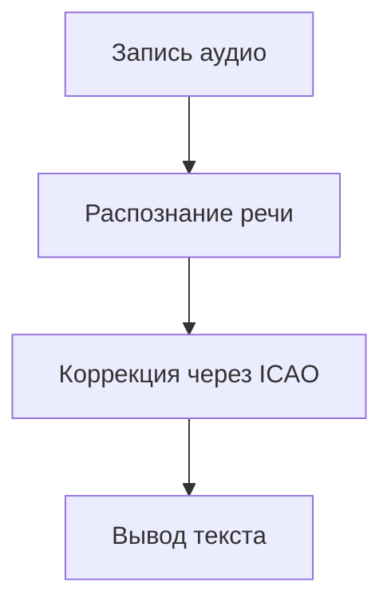

Вот исправленный вариант с рабочими якорными ссылками для GitHub:
# 🛫 AviaSTT - Система транскрипции авиационных переговоров

---

## 🧩 Основные объекты продукта

| Объект           | Атрибуты                     | Связи                          |
|------------------|------------------------------|--------------------------------|
| Пользователь     | Роль, ID, доступные функции  | Взаимодействует с аудиомодулем |
| Аудиовход        | Источник, уровень шума       | Передает данные в обработчик   |
| Модуль обработки | Алгоритмы шумоподавления     | Использует базу ICAO           |
| Транскрипция     | Текст, статус, метка времени | Связь с журналом операций      |

**Ключевые операции(норм?):**

---

## 📗 Ролевая модель

| Роль      | Функции                | Ограничения      |
| --------- | ---------------------- | ---------------- |
| Пилот     | Запись голоса          | ?                |
| Диспетчер | Получение транскрипции | Доступ к истории |
Каким образом назначаются роли?

---

## ✅ Требования

**Пользовательские:**
- Распознавание фразеологии ICAO.

**Технические:**
- 

---

## 🖼️ Прототипы интерфейса

---

## ✳️ Перспективы расширения

1. Поддержка нескольких языков(терминологии ICAO)
##  
##

[⬆ Наверх](#-aviaSTT---система-транскрипции-авиационных-переговоров)
