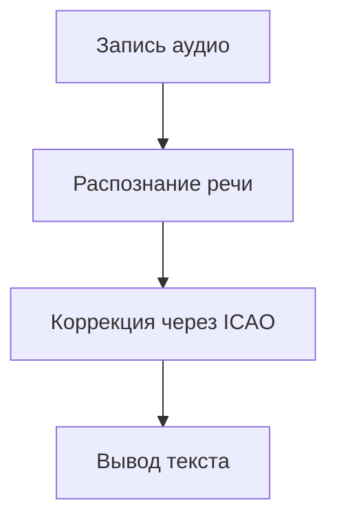

# 🛫 AviaSTT - Система транскрипции авиационных переговоров

---

## 🧩 Основные объекты продукта

| Объект           | Атрибуты                     | Связи                          |
|------------------|------------------------------|--------------------------------|
| Пользователь     | Роль, доступные функции  | Взаимодействует с аудиомодулем |
| Аудиовход        | Источник речи                     | Передает данные в обработчик   |
| Транскрипция     | Текст |   Выводится в приложение   |

### 🟩**Ключевые операции**

---

## 📗 Ролевая модель

| Роль      | Функции                | Ограничения      |
| --------- | ---------------------- | ---------------- |
| Пилот     | Запись голоса          | Речь на английском языке                |
| Диспетчер | Получение транскрипции | Доступ в интернет |

---

## ✅ Требования

**Пользовательские:**
- Доступ в интернет(для диспетчера)

**Функциональные:**
- Запись аудио в реальном времени
- Интеграция с базой данных ICAO
- Распознавание фразеологии ICAO

---

## 🖼️ Прототипы интерфейса

---

## ✳️ Перспективы расширения

1. Поддержка нескольких языков(терминологии ICAO)
2. Моментальная конвертация речи в текст
##  
##

[⬆ Наверх](#-aviaSTT---система-транскрипции-авиационных-переговоров)
